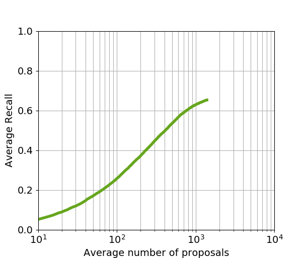
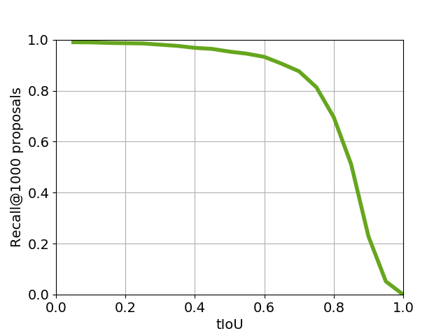

# SST-Tensorflow

Tensorflow Implementation of the Paper [SST: Single-Stream Temporal Action Proposals](http://vision.stanford.edu/pdf/buch2017cvpr.pdf) by Shyamal Buch *et al.* in *CVPR* 2017.

### Data Preparation

Please download video data and annotation data from the website [THUMOS14](http://crcv.ucf.edu/THUMOS14/download.html). Extract C3D features for non-overlap 16-frame snippets from the 412 videos (200 val videos + 212 test videos, I found one test video missing) for the task of temporal action proposals. Alternatively, you may download my provided [C3D features](https://pan.baidu.com/s/1ggMHZ71), and put them in dataset/thumos14/features/. If you are interested in the feature extraction, I refer you to this [code](https://github.com/yyuanad/Pytorch_C3D_Feature_Extractor).

*fc6* features are used in my experiment.

Please follow the script dataset/thumos14/prepare_gt_proposal_data.py to generate ground-truth proposal data for train/val/test split. I already put the generated files in dataset/thumos14/gt_proposals/.

After that, please generate anchor weights (for handling imbalance class problem) by uniformly sampling video streams (follow dataset/thumos14/anchors/get_anchor_weight.py) or just use my pre-calculated weights (weights.json).

### Hyper Parameters

The best configuration (from my experiments) is given in opt.py, including model setup, training options, and testing options.

### Training

Train your model using the script train.py. Run around 50 epochs and pick the best checkpoint (with the smallest val loss) for prediction.

### Prediction

Follow the script test.py to make proposal predictions.

### Evaluation

Follow the script eval.py to evaluate your proposal predictions.

### Results

You may download my trained model [here](https://pan.baidu.com/s/1mjBI2Nm). Please put them in checkpoints/. Change the file init_from in opt.py and run test.py !

**Update:** The predicted action proposals for the test set can be found [here](https://pan.baidu.com/s/1nwa2VLv). The result figures are put in results/1. They are slightly better than the reported ones.

<table>
  <tr>
    <th>Method</th>
    <th>Recall@1000 at tIoU=0.8</th>
  </tr>
  <tr>
    <th>SST (paper)</th>
    <th>0.672</th>
  </tr>
  <tr>
    <th>SST (my impl)</th>
    <th>0.696</th>
  </tr>
</table>

### Dependencies

tensorflow==1.0.1

python==2.7.5

Other versions may also work.

### Acknowledgements

Great thanks to Shyamal Buch for really helpful discussion.
